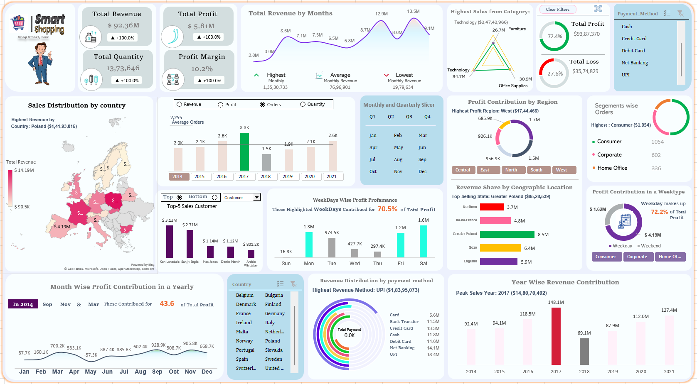

# 🛍️ Excel Smart Shopping Sales Analysis Dashboard

## Project Overview

The **Smart Shopping Sales Analysis Dashboard** is an interactive Microsoft Excel-based Business Intelligence project developed to analyze sales performance, profitability, customer purchasing behavior, payment methods, and regional sales trends.

The dashboard transforms raw transactional sales data into meaningful visual insights, enabling businesses to monitor key performance indicators (KPIs) and make informed, data-driven decisions.

---

# Problem Statement

Retail businesses generate thousands of sales transactions every year, making it difficult to identify business trends, profitable regions, customer behavior, and product performance.

The objective of this project is to convert raw sales data into an interactive Excel dashboard that enables users to:

- Monitor overall sales performance
- Analyze profit and profit margin
- Compare yearly and monthly sales trends
- Identify top-performing countries and regions
- Analyze customer segments
- Evaluate payment method preferences
- Track weekday and quarterly sales performance

---

# Dataset

The dataset contains transactional sales information, including:

- Order ID
- Order Date
- Customer Name
- Customer Segment
- Country
- State
- Region
- Category
- Sub Category
- Product Name
- Sales Amount
- Profit Amount
- Quantity Sold
- Discount
- Cost
- Payment Method

---

# Tools and Technologies

| Tool | Purpose |
|------|---------|
| Microsoft Excel | Data Analysis & Dashboard Development |
| Pivot Tables | Data Aggregation |
| Pivot Charts | Interactive Visualization |
| Slicers | Dynamic Filtering |
| VBA Macros | Dashboard Navigation & Automation |
| Conditional Formatting | KPI Highlighting |
| Excel Map Chart | Country-wise Sales Analysis |
| Doughnut Charts | Profit & Segment Analysis |
| Line & Column Charts | Trend Analysis |
| Form Controls | Interactive Dashboard Buttons |

---

# Methods

### Data Cleaning

- Removed duplicate records
- Standardized data formats
- Validated missing values
- Organized transactional data

### Data Transformation

Calculated important business metrics such as:

- Total Revenue
- Total Profit
- Profit Margin
- Total Quantity Sold
- Monthly Revenue
- Yearly Revenue
- Average Monthly Sales

### Dashboard Development

Used:

✔ Pivot Tables

✔ Pivot Charts

✔ KPI Cards

✔ Interactive Slicers

✔ Excel Map Chart

✔ Doughnut Charts

✔ Radar Chart

✔ Line Chart

✔ Column Chart

✔ Form Controls

✔ VBA Dashboard Navigation

---

# Dashboard Preview



---

# Dashboard Output

### KPI Summary

| Metric | Value |
|--------|--------|
| Total Revenue | $92.36M |
| Total Profit | $5.81M |
| Total Quantity Sold | 1,373,646 |
| Profit Margin | 10.2% |

---

# Key Insights

### Revenue Analysis

The business generated **$92.36 Million** in total revenue during the analysis period.

### Profit Analysis

Overall profit reached **$5.81 Million**, maintaining a healthy **10.2% profit margin**.

### Category Performance

The **Technology** category contributed the highest revenue among all product categories.

### Customer Segment

The **Consumer** segment placed the highest number of orders compared to Corporate and Home Office customers.

### Payment Method

**UPI** generated the highest revenue among all available payment methods.

### Regional Performance

The **West Region** achieved the highest overall profit contribution.

### Country Performance

**Poland** generated the highest sales revenue among all countries.

### Yearly Performance

The highest annual revenue was recorded in **2017**.

### Weekly Analysis

Weekdays contributed over **70%** of the total profit compared to weekends.

---

# Dashboard Features

Interactive Slicers for:

- Year
- Quarter
- Month
- Country
- Region
- Payment Method

Dynamic KPI Cards

Revenue Trend Analysis

Monthly Sales Analysis

Quarterly Sales Analysis

Year-wise Revenue Comparison

Profit Contribution by Region

Customer Segment Analysis

Country-wise Sales Map

Payment Method Analysis

Weekday Profit Analysis

Top & Bottom Country Analysis

One-Click Clear Filters Button

Automated Dashboard Navigation using VBA

Responsive Dashboard Design

---

# Project Structure

```text
Smart-Shopping-Sales-Analysis-Dashboard/

├── Dashboard/
│   └── Smart_Shopping_Dashboard.xlsx
│
├── Dashboard Preview/
│   └── Smart_Shopping_Dashboard.png
│
├── Dataset/
│   └── Superstore_Management_Orders.xlsm
│
├── Documentation/
│   └── Dashboard_Insights.pdf
│
├── README.md
│
└── LICENSE
```

---

# Result & Conclusion

The Smart Shopping Sales Analysis Dashboard successfully transforms raw sales transactions into an interactive Business Intelligence solution.

This dashboard enables business users to:

- Monitor business performance in real time
- Track revenue and profitability
- Compare yearly and monthly trends
- Analyze customer purchasing behavior
- Evaluate payment preferences
- Identify high-performing regions and countries
- Support strategic business decision-making through interactive visualizations

---

# Future Work

Future enhancements for this project include:

- Power BI Dashboard Version
- SQL Database Integration
- Power Query Automation
- Python-based Data Analysis
- Sales Forecasting Models
- Customer Segmentation using Machine Learning
- Automated Data Refresh
- Mobile-Friendly Dashboard

---

# Author & Contact

## Vikash Chauhan

**Student of Chandigarh University**

**Pursuing MCA (Artificial Intelligence & Machine Learning in Data Science)**

### Skills

Microsoft Excel • SQL • Power BI • Python • VBA • Data Analytics • Business Intelligence

- **LinkedIn:** https://www.linkedin.com/in/vikashchauhan01
- **GitHub:** https://github.com/Vikashchauhan-dev
- **Email:** Vikashchauhan10211@gmail.com

---

⭐ **If you found this project helpful, please give this repository a Star ⭐ and feel free to fork it for learning purposes!**
